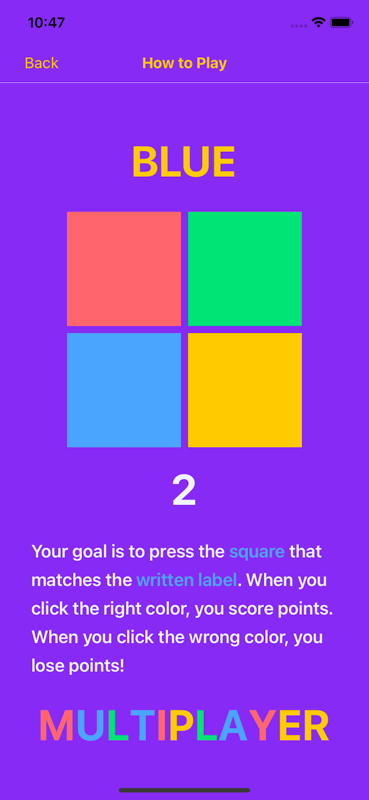
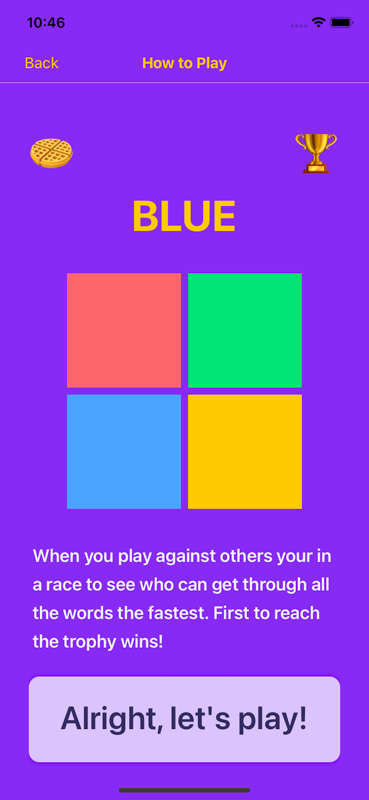

# [Stroopwafel](https://stroopwafel.app)
Stroopwafel is a casual multiplayer brain game made with React Native and Instant. This repo demonstrates how to use [InstantDB](https://instantdb.com) to add realtime and multiplayer features to your apps. If you’re curious, [check out this essay](https://www.instantdb.com/essays/next_firebase) to learn more about “why Instant”.

You can see Stroopwafel [live in the app store.](https://apps.apple.com/us/app/stroopwafel/id6470153525)

)
)


## How the game works

Players see a color label and must tap the matching colored square from a 2x2
grid. Correct = +1 point. Wrong = -2 points (min 0). Supports singleplayer
(beat the clock) and multiplayer (race to 13 points).

**Stack**: Expo + React Native, NativeWind (Tailwind CSS), React Navigation
(stack), InstantDB (real-time backend).

## Quickstart
If you haven't already, you'll need to [install Expo Go](https://docs.expo.dev/get-started/expo-go/).

After that clone the repo and install dependencies:

```bash
# Clone repo
git clone https://github.com/instantdb/instant-examples

# Navigate into the todos example
cd instant-examples/todos

# Install dependencies
pnpm i
```

If you haven't already, be sure to log into the Instant CLI

```bash
pnpx instant-cli login
```

Now let's initialize a new app with the Instant CLI.

```bash
pnpx instant-cli init
```

We've provided a schema in `instant.schema.ts` that you can push to your app.
You may have already pushed this during `init` in the previous step. If you
answered 'no' to the prompt during init, or if you're unsure whether you pushed
the schema, you can push it now.

```bash
pnpx instant-cli push
```


From there you should be ready to load up dev! From the project root

```
make dev
```

Huzzah!

## Building the project
If you want to try making a development build we recommend you set up [Expo Application Services](https://docs.expo.dev/eas/).

Edit `app.json` and `eas.json` to configure your own credentials. We've left the configuration we used for Stroopwafel as a reference.

## Submit Production Build
After we've verified development/preview build looks good, we may want to submit a new build the app store if we made some non-JS changes.

Doing so requires three steps:

```
# Manually increment "version" -- `autoIncrement` setting only affects buildNumber and not external facing version
# if we don't do this then the submit will fail
open app.json

# Build production app
make prod

# Submit production app
make submit
```

## Android
We tested on iOS only but getting Stroopwafel working in the play store should be straightforward. We'll update this repo with Android instructions in the future.


## Screens
Some screens of note:

- Main.js — Shows how to create a new room and associate it with a user.
- GameOverSingleplayer.js — Shows how to update a user’s highscore
- WaitingRoom.js — Shows to update multiple models in one transaction. Also shows how to fetch a specific model and a relation with `useQuery`
- Multiplayer.js — Shows how to fetch multiple relations for a namespace. Also shows how to easily update users scores. What’s especially nice about this is you can just update a user’s score, and Instant takes care of updating everyone else through the power of `useQuery`

There are a few additional screens that are pretty straightforward (JoinRoom, HowToPlay, Settings) but feel free to check out the code if you’re curious about how they work!

## Navigation Flow

```
Main
 |
 |-- Start -----------> Singleplayer ---> GameOverSingleplayer
 |                                             |         |
 |                          (Play Again) <-----+         |
 |                                                       |
 |   (Menu) <--------------------------------------------+
 |
 |-- Create Game -----> WaitingRoom -----> Multiplayer ---> GameOverMultiplayer
 |                        ^    |                                  |         |
 |   (Leave / Menu) <----/    |           (Play Again) ----------+         |
 |                            |                                            |
 |   (Menu) <---------------------------------------------------------+
 |
 |-- Join Game -------> JoinRoom ----> WaitingRoom (or Multiplayer if game in progress)
 |
 |-- Rules -----------> HowToPlay
 |
 +-- Profile ---------> Settings
```

## Multiplayer Game State Flow

```
                    Host creates room
                          |
                          v
         +---------> WAITING ROOM <---------+
         |           (lobby)                 |
         |              |                    |
    Players join     Host kicks        Play Again
    via room code    a player        (from game over)
         |              |                    |
         |              v                    |
         |       Player removed              |
         |       (kickedIds updated)         |
         |                                   |
         |         Host clicks Start         |
         |              |                    |
         |              v                    |
         |        GAME IN PROGRESS           |
         |       (race to 13 pts)            |
         |              |                    |
         |     Player reaches 13 pts         |
         |              |                    |
         |              v                    |
         |        GAME COMPLETED             |
         |              |                    |
         |              v                    |
         |        GAME OVER SCREEN ----------+
         |              |
         |         Menu button
         |              |
         |              v
         +--------- MAIN MENU
```

## Data Model (InstantDB)

```
$users (managed by Instant)
  handle: string (optional)
  highScore: number (optional)
  created_at: string (optional)

rooms
  code: string (indexed, optional)
  hostId: string
  readyIds: json (array of user IDs)
  kickedIds: json (array of user IDs)
  currentGameId: string (optional)
  created_at: string
  deleted_at: string (optional, soft delete)

games
  status: string ("GAME_IN_PROGRESS" | "GAME_COMPLETED")
  playerIds: json (array of user IDs)
  colors: json (array of {color, label})
  created_at: string

points
  val: number (current score)
  userId: string

Links:
  rooms <--many-to-many--> $users
  games <--many-to-many--> $users
  games <--many-to-many--> rooms
  games <--one-to-many----> points
```

## Auth & Permissions
We use Instant's guest auth as a way to uniquely identify users without requiring a sign-up flow. This keeps friction low and allows us to associate game data with
specific users (like high scores and room memberships) without needing
for email or social logins.

**Permissions** (`instant.perms.ts`):

| Namespace | Rule | Purpose |
|---|---|---|
| `attrs` | `create: false` | Lock down schema; no new attributes from clients |
| `$users` | `update: auth.id == data.id` | Only you can update your own profile |
| `$users` | `fields.email: auth.id == data.id` | Only you can see your own email |
| `rooms` | `update: isHost \|\| onlyMemberFields` | Host has full control; members can only toggle ready / clear currentGameId |
| `games` | `update: onlyMutableFields` | Only `status` can change after creation (prevents tampering with playerIds/colors) |
| `points` | `update: isOwner && onlyMutableFields` | Only the point owner can update `val` (prevents score manipulation) |
| All | `delete: false` | No hard deletes (rooms use soft delete via `deleted_at`) |


## Say Hello!
Do you want to build your own apps with Instant? If so, hopefully this repo has been helpful for you! We love hearing feedback and what folks want to build. Come say hello  [on our discord!](https://discord.gg/VU53p7uQcE)
